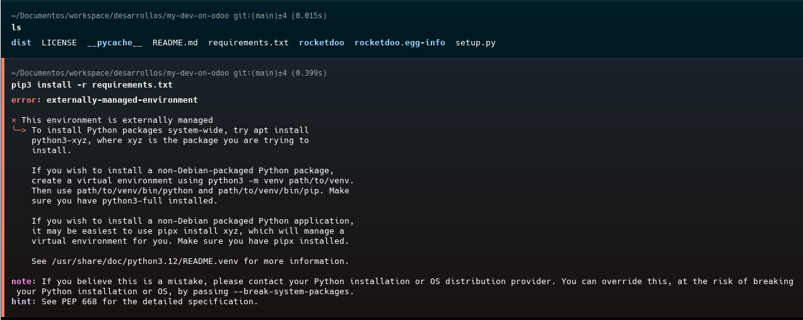
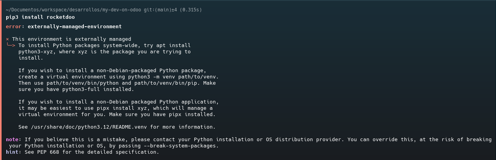
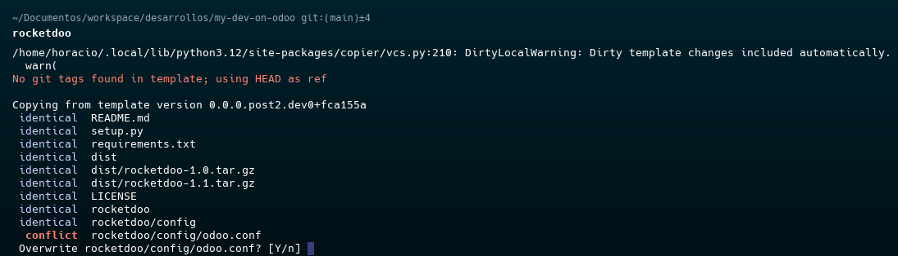

# Common Mistakes

In this section we will reveal some of the most common errors when using the development environment

***We also invite the users of this Framework, through our Help Desk, to send us incidents and bugs that are not present in this document, so that we can update and review each particular case.***

* First of all, we want to reemphasize that the repository of **ROCKETDOO** IS NOT CLONED!
A FORK!... The only way to use it is to create a new repository from the template.

## Failed to install the *requirements.txt*.

Faced with this error, the system suggests working with Python virtual environments, which is an excellent option.
However if you still want to install the requirements on your pc without a virtual environment
you can solve with this command:

~~~
pip3 install -r requirements.txt --break-system-packages
~~~

Now if you want to use a virtual environment, you should do it this way:

~~~
python3 -m venv venv && source venv/bin/activate && pip install -r requirements.txt
~~~

## Failure to install ROCKETDOO

The same as trying to install the requirements can happen with the installation of the framework

Solution: 

~~~
pip3 install rocketdoo --break-system-packages
~~~

## Launching ROCKETDOO in the wrong place

It is very common that you want to launch **ROCKETDOO** in the main root path of the project; for example,
as you can see in the image, you try to launch from the root path of the repository you created
*my-dev-on-odoo* when really it should be launched inside the *rocketdoo* folder, that is to say in :
*my-dev-on-odoo/rocketdoo*

To exit this conflict, it is necessary to press the keys **CTRL + C** and with this cancel the action
and then move to the correct directory:

~~~
cd rocketdoo
rocketdoo
~~~

Once done correctly we should see the following presentation image **ROCKETDOO**

---------------------------------------------------------------------------------------------------
   
For further assistance please send your ticket to our [Help Desk](https://odoo.hdmsoft.com.ar/mesa-de-ayuda)