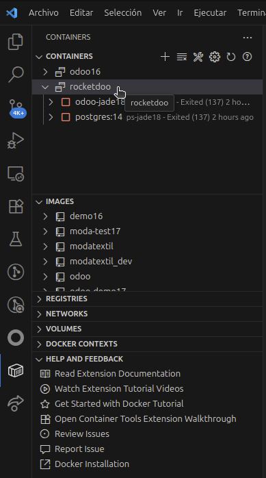
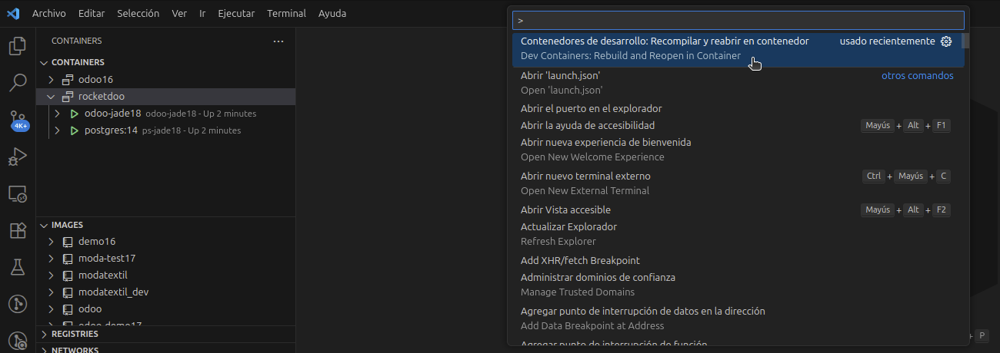

# Debugging in Odoo

One of the main steps to debug code in Odoo is to enter the container.  
Inside the container, you will be able to use the code debugging tool; in addition to having access to all the core modules of the system,  
both for the Community and Enterprise editions.

To access our container and be able to navigate inside the Odoo system,  
we must verify that our container is running. For this, we can use a terminal on our PC,  
a terminal inside VSCode, or use the recommended extension **"Dev Container"**.

## Container Stopped

## Container Running

Once we have our container running, we need to press the following key combination:

**SHIFT + CTRL + P**

And in the search palette, we need to search for the following:

***Dev Containers: Rebuild and Reopen in Container***

This will allow us to connect remotely to the container where our Odoo instance is running.  
It is important, once inside the container, to wait for VSCode to finish indexing our entire workspace.

Once indexing is 100% complete, we will be able to access our Debugging tool (recommended extension) and execute any of our debugging options;  
whether it's the Python debugger, the JavaScript debugger, or both:

***"Odoo: Debug-Breakpoints"***

***"Debug POS JavaScript in Chrome"***

***"Odoo Full Debug (Python + JS)"***

Once our debugger is running, we can start using breakpoints and reviewing our developments quickly and safely.

## Demo Video: How to Debug Odoo with VS Code?

<iframe width="560" height="315" 
src="https://www.youtube.com/embed/45m9DcmZvRk" 
title="Odoo Debug" frameborder="0" 
allow="accelerometer; autoplay; clipboard-write; encrypted-media; gyroscope; picture-in-picture" 
allowfullscreen></iframe>
