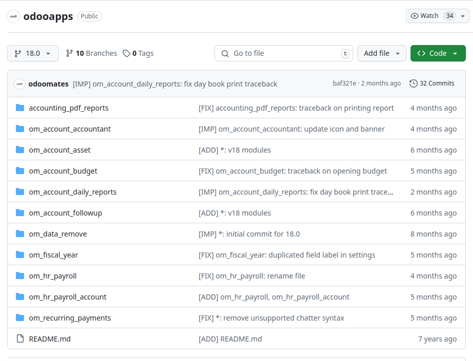
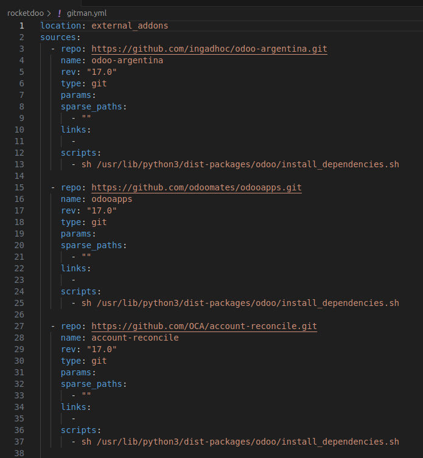

# Public Repositories

Our launcher **ROCKETDOO** offers the option to use both private and public repositories.  
In this section, we’ll focus on public repositories, which are especially useful for developers  
as they allow for the automatic installation of directories, dependencies, and required libraries.

**ROCKETDOO** uses the *Gitman* tool to handle this setup. During the configuration, it will prompt you for:

- The URL of the public repository  
- The version (branch/tag) to use  
- A custom name to identify the repository or module package

This feature is particularly helpful when working with third-party module packages  
that often include several interdependent modules. A common example is accounting-related add-ons  
that enhance the functionality of Odoo Community Edition.

A good example is the package provided by *Odoo Mates*, which offers multiple accounting-related modules.

As shown in the image above, *odooapps* contains a collection of modules that enhance accounting features,  
many of which have dependencies between them.

Without this automation, the developer would need to manually research which modules are required,  
verify their dependencies, read their contents, and check for `requirements.txt` files—  
a tedious and error-prone process.

Once you load the desired public repositories, **ROCKETDOO** will take care of everything:  
it generates and configures a `gitman.yml` file that stores all the information you provide during the setup.

Below is an example image of a generated Gitman configuration:

In the image, we can see three different module packages, each associated with an Odoo version and a descriptive name.

These packages will be available inside the Odoo container under the  
**external_addons** folder at the path:  
`/usr/lib/python3/dist-packages/odoo/external_addons`.

The `gitman.yml` file is generated automatically when you provide the repository information during the Rocketdoo launch process.

### Summary

Using *Gitman* is especially useful when working with **module packages**,  
as opposed to single independent modules. A single module can simply be cloned into the **addons** folder,  
but for complex packages with dependencies, Gitman streamlines the process significantly.
