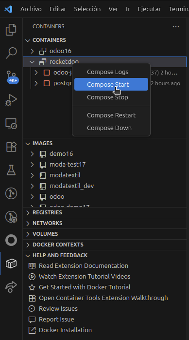
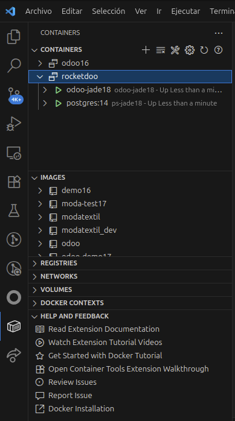
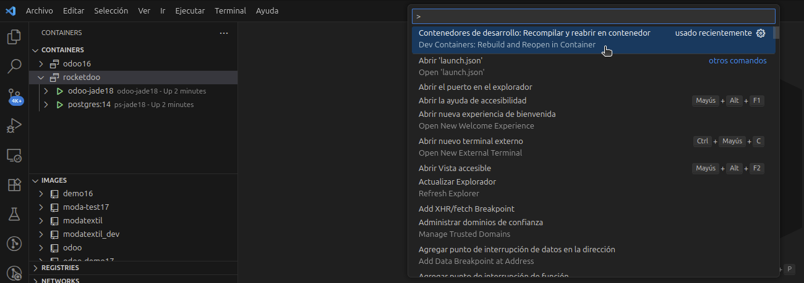
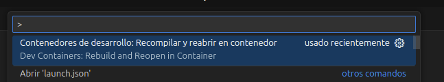
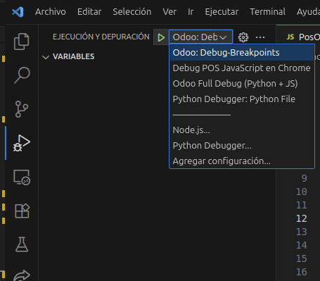

# Depurando en Odoo

Uno de los pasos principales para poder depurar codigo en Odoo, es ingresar al contenedor. 
Ya que dentro del el
se podra usar la herramienta de depuracion de codigo; ademas de contar con todos los modulos del core del sistema,
tanto para ediciones Community, como Enterprise.

Para poder ingresar en nuestro contenedor, y asi poder navegar desde el interior del sistema Odoo
debemos verificara que nuestro contenedor esta corriendo; para esto podemos usar nuestra terminal en nuestra PC,
tambien en una terminal de VSCode o usando la extension recomendada **"Dev Container"**

## Contenedor Detenido

## Contenedor Inicializado

Una vez que ya tenemos nuestro contenedor corriendo, debemos presionar la siguiente combinacion de teclas: 

**SHIFT + CTRL + P**

Y en nuestra paleta de busqueda debemos buscar lo siguiente: 

***Contenedores de Desarrollo: Recompilar y reabrir en contenedor***

Esto nos dara paso a la conexion remota con el contenedor donde esta corriendo nuestro Odoo.
Es importante una vez ingresado en el contenedor, esperar que nuestro VSCode Indexe todo nuestro arbol de trabajo.

Una vez indexado al 100% Podremos acceder a nuestra herramienta de Depuracion (extension recomendada) y ejecutar cualquiera 
de nuestras opciones de depuracion; ya sea el depurador de Python o de JavaScript o ambos: 

***"Odoo: Debug-Breakpoints"***

***"Debug POS JavaSScript en Chrome"***

***"Odoo Full Debug (Python + JS)"***

Una vez iniciado nuestro depurador, ya podremos utilizar puntos de interrupcion y revisar nuestros desarrollos de manera rapida
y segura.

## Video Demostracion ¿Como Depurar en Odoo con VS Code?

<iframe width="560" height="315" 
src="https://www.youtube.com/embed/45m9DcmZvRk" 
title="Odoo Debug" frameborder="0" 
allow="accelerometer; autoplay; clipboard-write; encrypted-media; gyroscope; picture-in-picture" 
allowfullscreen></iframe>

