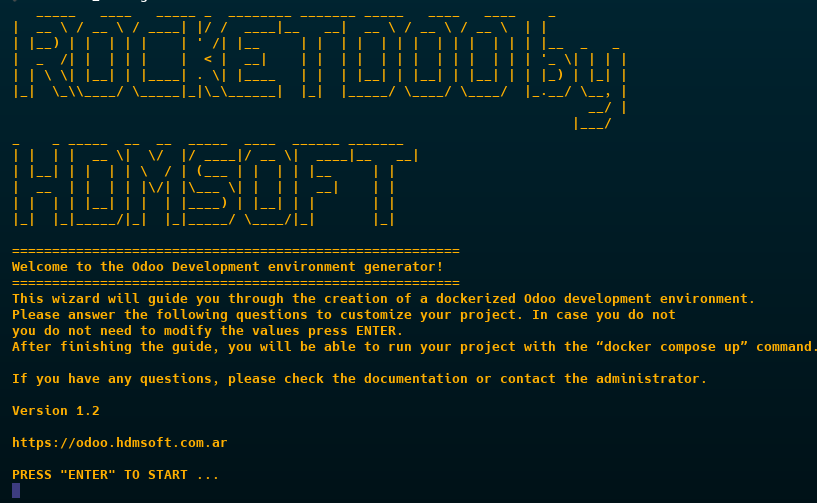

# Lanzando ROCKETDOO

Ahora podemos iniciar ***ROCKETDOO*** ejecutando su interfaz CLI con el siguiente comando:

~~~
rocketdoo
~~~

Esto abrirá su pantalla interactiva. Nos dará la bienvenida y, tras presionar ***ENTER***, comenzará a solicitarnos la información necesaria para crear nuestro entorno de desarrollo.

## ¿Qué nos pregunta Rocketdoo?

El CLI nos presentará una serie de preguntas para configurar nuestro entorno de desarrollo según nuestras necesidades:

* Versión de Odoo  
* Nombre del proyecto  
* Versión de PostgreSQL  
* Nombre del contenedor de base de datos  
* Contraseña maestra  
* Nombre de la imagen Docker a construir  
* Nombre del contenedor web de Odoo  
* Puerto de Odoo  
* Puerto de VS Code  
* Si queremos que los contenedores se reinicien automáticamente, y de qué forma

Luego nos preguntará lo siguiente:

* ¿En qué edición de Odoo vamos a trabajar?: Community (“ce”) o Enterprise (“ee”)  
* Si usaremos repositorios privados  
* Si usaremos repositorios de terceros:
    * URL del repositorio  
    * Versión del repositorio  
    * Nombre local que le daremos al repositorio  
    * ...y si deseamos seguir agregando más repositorios de terceros

No detallaremos cada pregunta, ya que Rocketdoo nos ofrece opciones por defecto y sugerencias útiles durante el proceso.

---

## Consejos

Es importante tener en cuenta las siguientes pautas de uso:

1. Los nombres que asignes al contenedor web de Odoo, al contenedor de PostgreSQL y al proyecto deben ser únicos.  
   **No reutilices nombres** si ya has creado un proyecto anteriormente.

   Si repites algún nombre y tratas de lanzar el proyecto, Docker te dará un error indicando que esos contenedores ya existen.

   En ese caso, presiona ***CTRL + C*** para cancelar la operación y vuelve a ejecutar Rocketdoo.

2. Lo mismo ocurre con los puertos de Odoo y VS Code: no deben repetirse en otros proyectos.  
   Esto permite tener varios entornos de desarrollo ejecutándose simultáneamente sin conflictos.

   Por ejemplo, si tu primer proyecto usa el puerto **8069**, en el siguiente puedes usar **8169**. Lo mismo aplica al puerto de VS Code.

3. Una vez que termines de trabajar con un entorno, puedes detenerlo o incluso eliminarlo por completo con los siguientes comandos:

Para detener los contenedores:
~~~
docker compose stop
~~~

Para eliminarlos junto con sus volúmenes:
~~~
docker compose down -v
~~~

Esto liberará los puertos, permitiendo reutilizarlos en otros entornos de desarrollo.

---

***Si vas a desarrollar con Odoo Enterprise, asegúrate de colocar la carpeta *Enterprise* en el directorio de trabajo al mismo nivel que *addons*, antes de lanzar ROCKETDOO.***

---

## ¡Todo listo!

Una vez respondidas todas las preguntas de Rocketdoo, puedes lanzar tu entorno ejecutando:

~~~
docker compose up
~~~

*Nota: Este paso puede tardar entre 1 y 8 minutos dependiendo de la cantidad de repositorios de terceros que hayas cargado.  
Durante ese tiempo, Rocketdoo clonará los repositorios, los copiará dentro del contenedor web, instalará las dependencias necesarias y descargará las imágenes oficiales de Odoo y PostgreSQL.*

Una vez que el entorno esté listo y veas el log de Odoo ejecutándose, podrás ingresar desde tu navegador a:

~~~
http://localhost:8069
~~~

Desde ahí, podrás crear tu primera base de datos, instalar los módulos necesarios y trabajar con los paquetes de terceros que seleccionaste durante la configuración.
