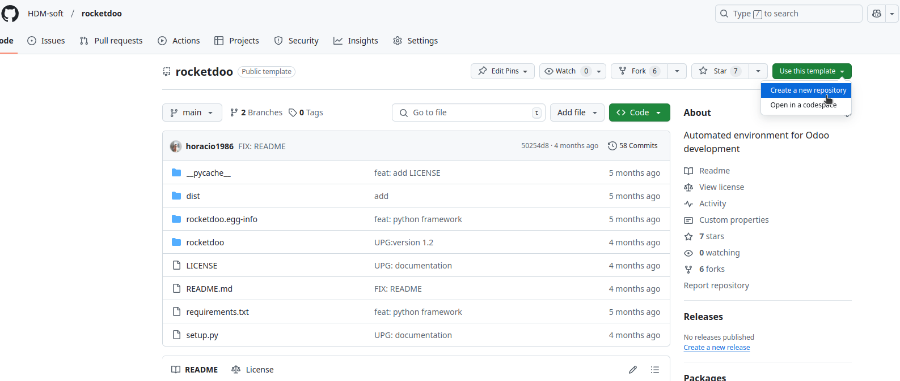
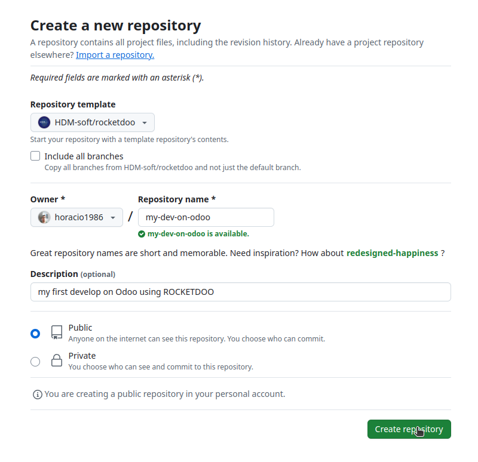
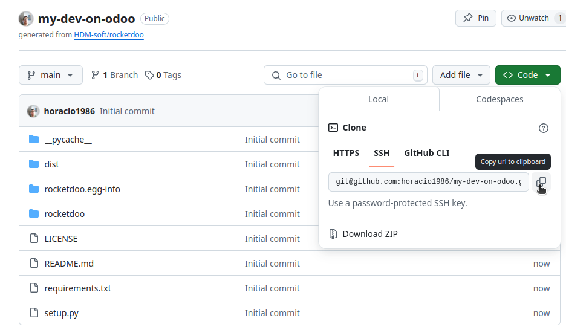
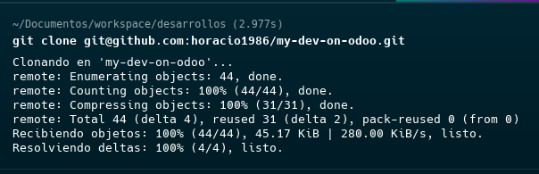
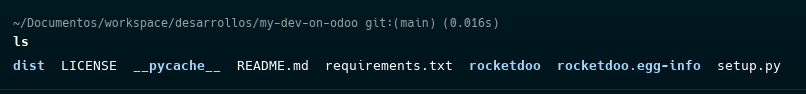
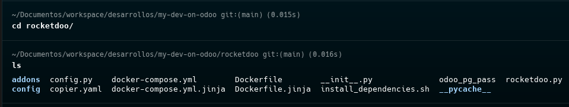
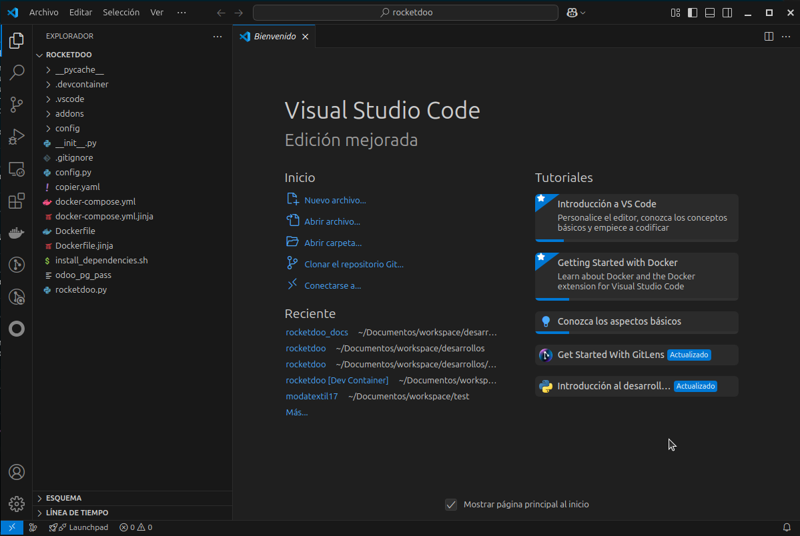

# Paso a Paso

### Paso 1:

Lo primero que debemos hacer es ir al repositorio de **ROCKETDOO** <a href="https://github.com/HDM-soft/rocketdoo" target="_blank">aquí</a>

Es imprescindible entender que este repositorio está construido como una **Plantilla**, por lo tanto, debe usarse como plantilla y NO debe clonarse ni bifurcarse directamente.

### Paso 2:

Usa la plantilla para crear tu propio repositorio de desarrollo haciendo clic en el botón *use this template* y luego en *create new repository*.
Esto te llevará a tu cuenta de GitHub para que puedas comenzar a crear tu repositorio de desarrollo.

### Paso 3:

En tu cuenta, deberás nombrar tu proyecto de desarrollo y, si lo deseas, agregar una descripción.  
Es importante que **NO selecciones** *include all branches*, ya que solo necesitas la rama *main* para desarrollar.  
Una vez listo, decides si el desarrollo será público o privado y haces clic en el botón *create repository*.

### Paso 4:

Una vez creado el repositorio, puedes clonarlo copiando el enlace por *URL* o por *SSH*.

### Paso 5:

Ingresa al repositorio creado y clonado desde nuestra plantilla **ROCKETDOO** con el siguiente comando:

~~~
cd my-dev-on-odoo
~~~

Una vez dentro del repositorio, listamos todos los archivos con el comando:

~~~
ls
~~~

### Paso 6:

En este paso ya deberías tener instalada la librería **ROCKETDOO**.  
Si no la tienes, puedes instalarla con el siguiente comando:

~~~
sudo pip install rocketdoo
~~~

Asegúrate de que **ROCKETDOO** esté instalado correctamente.  
***(Si la terminal genera un error al intentar instalar ROCKETDOO u otra librería, veremos cómo resolverlo en la sección de "Errores comunes")***

### Paso 7:

Instala los requerimientos del archivo ***requirements.txt***:

~~~
sudo pip install -r requirements.txt
~~~

### Paso 8:

Ahora debes ingresar a la subcarpeta **rocketdoo**, es decir, quedarás ubicado en ***my-dev-on-odoo/rocketdoo***

~~~
cd rocketdoo
~~~

### Paso 9:

En este paso puedes abrir Visual Studio Code con el comando:

~~~
code .
~~~

Y esto abrirá tu área de trabajo, es decir, el entorno de desarrollo.

---

¡¡¡PERO NO TE EMOCIONES AÚN!! ¡TODAVÍA NO VAMOS A TRABAJAR EN VS CODE! En la siguiente página comenzaremos con el [Lanzamiento de Rocketdoo](launch.md). >>>>
