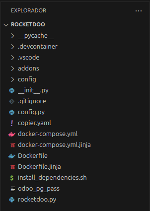
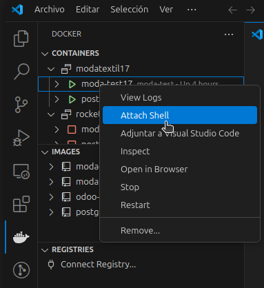
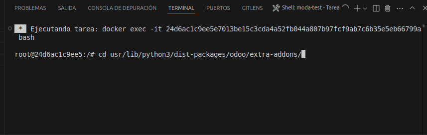
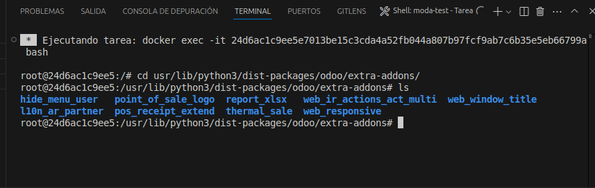

# Estructura de Rocketdoo

En esta sección veremos con mayor claridad cómo está conformada la estructura de Rocketdoo, y de esta manera podremos entender mejor cómo funciona internamente, o al menos comprender la importancia y el uso de algunas carpetas y archivos de Rocketdoo.

Como se puede ver en la imagen, hay una larga lista de carpetas y archivos que componen toda la estructura de Rocketdoo.  
Sin embargo, nos centraremos en las carpetas y archivos más relevantes para un desarrollador.

Estas carpetas y archivos deberían ser conocidos por cualquier desarrollador de Odoo.

---

## /Addons

Primero mencionaremos la carpeta **addons**.

Una vez que tengas tu entorno listo, ya sea trabajando en Visual Studio Code o directamente desde la terminal, esta carpeta se utilizará para alojar los desarrollos que vayas a realizar, así como algunos módulos necesarios de forma individual.

Puedes crear una carpeta con el nombre de tu módulo y agregar su contenido, o usar la extensión **Docker** de VSCode. Con la opción *Attach Shell* podrás abrir una terminal y moverte al directorio donde se encuentran los módulos:  
`/usr/lib/python/dist-packages/odoo/extra-addons`.

Desde ahí, puedes usar el comando **scaffold** de Odoo para generar un nuevo módulo.

> **Importante:** La carpeta “addons” dentro del contenedor de desarrollo está mapeada como un volumen hacia la carpeta “extra-addons”.  
> Por eso debemos dirigirnos a esa carpeta dentro del contenedor.  
> Recuerda que la carpeta original `addons` pertenece al núcleo de Odoo, lo cual será más evidente cuando estemos depurando código desde dentro del contenedor.

Para crear un nuevo módulo con el comando `scaffold`, debes ejecutarlo así:

~~~
odoo scaffold <mi_modulo> .

~~~

Esto generará un módulo con los archivos y estructura necesarios para comenzar a desarrollar en el directorio actual.

Una vez creado, también verás que el nuevo módulo aparece en tu entorno de trabajo dentro de la carpeta **addons** en VSCode.

> **Recuerda:** La carpeta `addons` en tu directorio de trabajo se llama `extra-addons` dentro del contenedor de Odoo.

---

## /Config/odoo.conf

El archivo **odoo.conf**, ubicado en el directorio **/config/**, es especialmente importante para desarrolladores experimentados en Odoo.

Este archivo contiene toda la configuración del sistema a nivel de servidor.  
Gestiona el mapeo de los módulos de terceros y desarrollados, la configuración de la contraseña maestra, la ruta del archivo de logs, entre otros.

De todos modos, no te preocupes, ya que normalmente no será necesario modificar este archivo manualmente, pues se configura automáticamente durante el arranque del framework.

---

## Enterprise

Como habrás visto, al lanzar **ROCKETDOO**, casi al final del proceso se te pregunta si deseas trabajar con la versión Community o Enterprise de Odoo.

¡Muy bien! Si tu respuesta es `"ce"` (Community Edition), no necesitas hacer nada adicional.

Pero si tu respuesta es `"ee"` (Enterprise Edition), es muy importante que **antes** de lanzar Rocketdoo tengas la carpeta **Enterprise** en tu directorio de trabajo, al mismo nivel que la carpeta **addons**.

De esta manera, el sistema podrá mapear correctamente los módulos de Enterprise y hacer la configuración necesaria en el entorno para ejecutar esta edición de Odoo.
