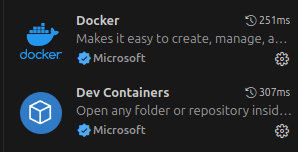

# Recommended Extensions for Visual Studio Code

In this section we will make a list of the extensions that we recommend to use, both the basic ones, and those that we know will provide better
options to work more comfortably in VSCode and avoid the use of the terminal or complex concepts in Docker.

Although later on, we will share the commands that will be useful to deepend in the use of
environment and tools like *Docker* and *Gitamn*.

## Basic and Necessary Extensions

1. Docker (Microsoft Official)
2. Dev Containers (Microsoft)

## More Extensions

* Auto Close Tag - Jun Han
* GitLens - GitKraken
* Odoo Ide - Trinh Anh Ngoc (esto es lo mejor del mundo al menos en odoo 16)
* Odoo shorcuts - mvintg
* Odoo Snippets - Droggol
* Prettier Code formater - Prettier
* Python Indent - Kevin Rose
* XML - Red Hat
* XML Formatter - Fabian Lauer
* XML Tools - Josh Johnson